<!-- No link around the <picture>: GitHub auto-links images, and a nested
     link pushes the  out of <picture>, breaking the dark variant. -->
<picture>
  <source media="(prefers-color-scheme: dark)" srcset="assets/banner-dark.svg">
  
</picture>

 

 

I build modern, scalable web products with **Next.js, React, Node.js and AWS** — for startups that need software _shipped_, not just written.

Right now I'm a commerce developer at **18th Digitech**, building eCommerce on **Magento 2 / Adobe Commerce** alongside Next.js and cloud tooling. I like untangling hard problems, wiring up third-party services, and lately, putting AI to work inside real products.

- 🎓 B.Tech in Computer Science — MIET, Meerut (2022 – 2026)
- 🌱 Exploring AI-driven apps, system design and cloud architecture
- 💬 Ask me about Next.js, eCommerce, CMS dashboards and shipping fast
- 📫 [suryanshpatwal@gmail.com](mailto:suryanshpatwal@gmail.com) — I usually reply within a day

 

## How I can help

<table>
  <tr>
    <td width="33%" valign="top">
      <h3>🧩 Full-Stack Web Apps</h3>
      Production-grade SaaS, dashboards and internal tools built with Next.js, React and Node.js — from database design to deployment.
    </td>
    <td width="33%" valign="top">
      <h3>🛒 E-Commerce & Brand Sites</h3>
      Fast, SEO-optimized storefronts and brand websites with conversion-focused design that turn visitors into paying customers.
    </td>
    <td width="33%" valign="top">
      <h3>🗂️ Custom CMS & Admin Panels</h3>
      Configurable content systems, CRMs and lead-management dashboards so your team can run the business without touching code.
    </td>
  </tr>
</table>

 

## Where I've worked

| Role | Company | When |
| :-- | :-- | :-- |
| **Development Trainee** | [18th Digitech](https://www.18thdigitech.com/) · Noida, India | Aug 2025 – Present |
| **Backend Developer** | [VitalDrive Innovations](https://www.vitaldriveinnovationsltd.com/) · London, UK · Remote | Oct 2025 – Feb 2026 |
| **Full Stack Developer** | [Travogenic Holidays](https://www.travogenic.com/) · Ghaziabad, UP | May 2025 – Jul 2025 |
| **Frontend Developer Intern** | [YANA Travel](https://yana.travel/) · Remote | Sep 2024 – Dec 2024 |

 

## Featured projects

| Project | What it is | Built with |
| :-- | :-- | :-- |
| **[Yatra Loka](https://yatraloka.com/)** | End-to-end travel booking platform with a custom admin dashboard, so the business team runs its own content. | Next.js · CMS · Admin dashboard |
| **[Hump & Horns](https://humpandhorns.in/)** | Full eCommerce platform for a Karnataka apparel brand preserving indigenous cattle heritage — every purchase supports conservation. | Next.js · E-commerce · SEO |
| **[Sea Sky Holiday](https://seaskyholiday.com/)** | Travel platform for discovering destinations, curated packages and trip inquiries, fully managed from an admin panel. | Next.js · CMS · Lead management |
| **[VitalDrive](https://www.vitaldriveinnovationsltd.com/)** | AI + sensor tech that turns cars into health guardians by monitoring driver vitals in real time. | Next.js · Python · Flask · AI/ML |
| **[Socials](https://sm-impact.vercel.app/)** · [code](https://github.com/suryanshpatwal/sm-impact) | Social platform with posts, follows, DMs, notifications and real-time messaging. | Next.js · TypeScript · Stream API |
| **[Travogenic](https://www.travogenic.com/)** | Travel booking site plus a role-based CRM managing 5,000+ customer records. | Next.js · TypeScript · RBAC |

<a href="https://surya1.me/#projects">See every case study on surya1.me →</a>

## Skills

  <picture>
    <source media="(prefers-color-scheme: dark)" srcset="https://skillicons.dev/icons?i=html%2Ccss%2Cjs%2Cts%2Creact%2Cnextjs%2Ctailwind%2Cnodejs%2Cexpress%2Cphp%2Cflask%2Cpython%2Cjava&theme=dark&perline=13">
    
  </picture>
   
  <picture>
    <source media="(prefers-color-scheme: dark)" srcset="https://skillicons.dev/icons?i=mongodb%2Cmysql%2Cpostgres%2Caws%2Cvercel%2Cgit%2Cgithub%2Cgithubactions%2Clinux%2Cvscode%2Cfigma&theme=dark&perline=13">
    
  </picture>

Also at home with **Magento 2 / Adobe Commerce**, Shadcn UI, Framer Motion, REST APIs and **AWS Cloud Practitioner** fundamentals.

 

## Code, commits & side quests

<picture>
  <source media="(prefers-color-scheme: dark)" srcset="https://github-readme-stats.vercel.app/api?username=suryanshpatwal&show_icons=true&hide_border=true&border_radius=24&bg_color=211E2C&title_color=A894FF&icon_color=FF6B57&text_color=ECEAF3&ring_color=A894FF">
  
</picture>
<picture>
  <source media="(prefers-color-scheme: dark)" srcset="https://github-readme-stats.vercel.app/api/top-langs/?username=suryanshpatwal&layout=compact&langs_count=8&hide_border=true&border_radius=24&bg_color=211E2C&title_color=A894FF&text_color=ECEAF3">
  
</picture>

<picture>
  <source media="(prefers-color-scheme: dark)" srcset="https://streak-stats.demolab.com?user=suryanshpatwal&hide_border=true&border_radius=24&background=211E2C&ring=A894FF&fire=FF6B57&currStreakNum=ECEAF3&sideNums=ECEAF3&currStreakLabel=A894FF&sideLabels=A19DB0&dates=A19DB0&stroke=34303F">
  
</picture>

 

  

